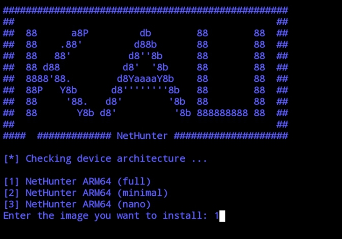
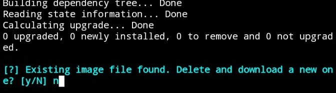
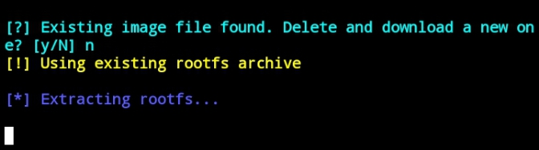
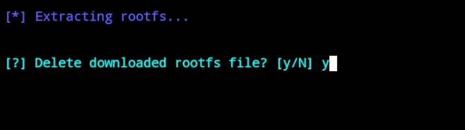
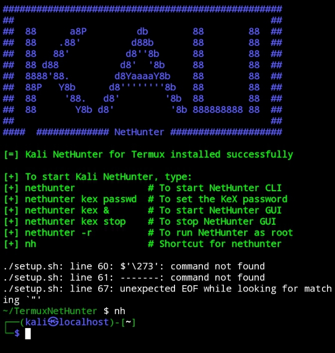

## Get Started

Please Read and Follow below before to start automation of nethunter on termux

### NetHunter Compatibility (based on architecture):

Required CPU Architecture: arm64 (aarch64)

Storage: At least 8–12 GB free for full rootfs

RAM: At least 2–4 GB for better stability

OS: Android 8+ recommended

### Phones that are commonly compatible with NetHunter (arm64):

Most of these use Snapdragon or MediaTek:

Snapdragon-based (common)

OnePlus (5, 6, 7, 8, 9 series)

Google Pixel (2 and above)

Xiaomi (Redmi Note 8, 9, 10 series)

Samsung Galaxy S9, S10, Note 9

Poco X3, F1


### MediaTek-based (also work in many cases)

Realme C3, C15 (G35, G70)

Infinix Note series (with Helio G85/G90T)

Tecno Pova, Spark series

Some Nokia (G10, G20)

### Download Termux Here 
if you are not download the termux I will recommend for you to download the github version and choose the universal version

https://github.com/termux/termux-x11/releases

after the installation open the app and follow this step

### Device Compatibility

Check Your device if Compatible for aarch64

```sh
uname -m
```

### Update Termux First
Update the termux environment
```sh
apt update && apt upgrade -y

```
### Install Git
then install the git by using this commands
```sh
apt install git -y

```
### Clone the Repository 
Copy Paste this to clone my automation repo
```sh
git clone https://github.com/cordy001/TermuxNetHunter.git

```
this is also depends how fast your internet speed to download all the fragments
### Open the folder
after the cloning open the folder by typing cd TermuxNetHunter
```sh
cd TermuxNetHunter

```
### Run the file
Then Run this to Start the automation
```sh
./setup.sh

```

### Install the NetHunter
after the automation setUp just follow this step



Choose 1 NetHunter ARM64 (full)



Then Choose N to use the current images (recommended)

if you want, you can Choose Y to re-download the image/iso files again (be careful have some error)



Wait for all the data will be fully extract this make takes a while



click Y to delete the existing tar files or You want to back-up it

### After the Installation 


open the netHunter by typing nh and follow the last instructions below 👇 

Copy paste this to install the Kali GPG Keys and this is also setup everything 

```sh
curl -fsSL https://archive.kali.org/archive-key.asc | sudo gpg --dearmor -o /etc/apt/trusted.gpg.d/kali-archive.gpg

sudo apt update

chown -R postgres:postgres /var/lib/postgresql/17/main

sudo apt upgrade -y
```
after that the kali will ask for password the password is 
```sh
kali
```
### For more tutorial I a'm already exist on Tiktok

if you want video tutorial check this link from my tiktok account 😁😁

### Privacy and Term of Use

This project is provided for educational purposes only. By using this tool, you agree to the following:

You are solely responsible for how you use this project.

This automation script is currently in beta version and may contain bugs, incomplete features, or cause unexpected behavior.

The author is not responsible for any misuse, data loss, or damage caused by improper use of this setup.

Do not use this tool to perform unauthorized activities or violate any laws.

This script may interact with your device’s system settings and may require root privileges.


By proceeding with the installation, you agree that:

You understand the risks.

You are using this tool in a legal and ethical manner.

You are using it on your own device or with permission from the device owner.


Your data is not collected, tracked, or shared by this script in any way.
